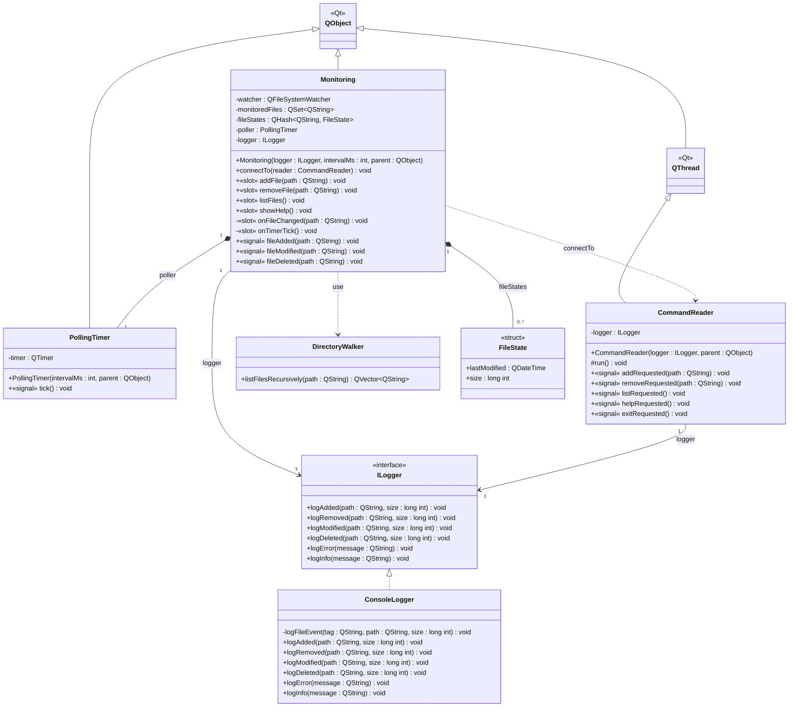

# Документация к лабораторной работе: мониторинг файлов

Консольное приложение на C++ для слежения за изменениями файлов. Разработано в рамках курса «Технологии программирования» (4 курс, 2 семестр).

## Описание

Программа отслеживает две характеристики файла: существование и размер. При изменении состояния наблюдаемого файла выводится уведомление в консоль. Для обработки событий используется механизм сигнально-слотового соединения Qt.

## Требования по заданию

Программа обрабатывает три ситуации:
1. Файл существует и не пустой: выводится факт существования и текущий размер
2. Файл существует и был изменён: выводится сообщение об изменении и новый размер
3. Файл не существует: выводится информация об отсутствии файла

## Технологии

- Qt 5
- C++17
- CMake 3.2 / qMake

## Архитектура

- `Monitoring` — основной класс, отслеживает файлы через `QFileSystemWatcher` и таймер опроса (100 мс)
- `PollingTimer` — периодически испускает сигнал `tick()` для опроса состояния файлов
- `ILogger` — абстрактный интерфейс логирования
- `ConsoleLogger` — реализация, выводящая события в консоль
- `CommandReader` — читает команды пользователя из stdin в отдельном потоке
- `DirectoryWalker` — рекурсивно обходит файлы в директории

## Сборка

### Qt Creator (qMake)

Открыть файл `file_monitoring.pro` в Qt Creator и собрать проект.

### CMake

```bash
mkdir build && cd build
cmake ..
cmake --build .
```

## Использование

```
add <путь>      — добавить файл или папку в мониторинг
remove <путь>   — удалить файл или папку из мониторинга
list            — показать список отслеживаемых файлов
help            — показать справку по командам
exit            — выйти из программы
```

## Диаграмма классов



Обозначения: `<|--` — обобщение (наследование), `<|..` — реализация интерфейса,
`*--` — композиция (агрегат владеет частью), `-->` — направленная ассоциация,
`..>` — зависимость; в кавычках указана кратность концов связей.
